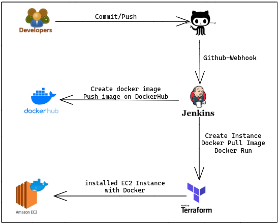
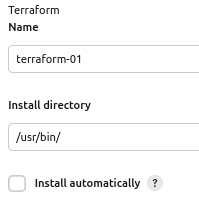
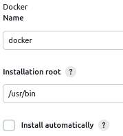
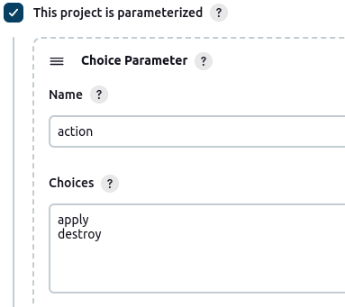

# The application is deployed in a container on AWS EC2 with Terraform and Jenkins manages this process.
- Create Docker image and push the image DockerHub
- Create EC2-instance and install docker into EC2 with using EC2
- Pull the Docker image in EC2 from DockerHub and run.
- Manage with Jenkins pipeline the above steps.



## Create and configure Jenkins Server
```txt
Instance Type: t2.micro
AMI: Amazon Linux 2
Security Groups: 22, 80, 8080
```
- Install `jenkins`, `docker`, `docker-compose` and `awscli2` in Jenkins Server.
- Create a `Role` about `AmazonEC2FullAccess` on the `Jenkins Server`. Go `Action > Security > Modify IAM Role` and attach role `AmazonEC2FullAccess`.

- Connect `Jenkins Sever` and go to the `Manage Jenkins > Manage Plugins` and install the following.
```txt
locale
Deploy to container 
Docker 
Terraform
SSH-Agent
```
- Configure `Terraform` and `Docker` in `Global Tool Configuration`  

    - `Terraform` 
        - Name: `terraform-01`
        - Install directory: `/usr/bin`

    

    
    - `Docker`
        - Name: `docker`
        - Install directory: `/usr/bin`

    

- Manage Credentials
    - Kind: `SSH Username with private key`
    - ID: `ec2-firstkey`
    - Description: `ec2-firstkey`
    - Username: `ubuntu`
    - Copy private key

    - Kind: `Username and password`
    - Username: `project`
    - Password: `your github token`
    - Description: `github`

    - Kind: `Secret text`
    - Secret: `your dockerhub password`
    - ID: `docker-pwd`
    - Description: `docker-pwd`
## Create Dockerfiles

- Firstly create dockerfile from `ubuntu` image.

```bash
FROM ubuntu
RUN apt-get update -y
RUN apt-get install python3 -y
RUN apt-get install python3-pip -y
RUN pip3 install flask
COPY ./app /app
WORKDIR /app
CMD python3 ./app.py
```

- Create other Dockerfile.

```bash
FROM alpine
RUN apk update && apk upgrade
RUN apk add --update python3
RUN apk add py3-pip
RUN pip3 install flask
COPY ./app /app
WORKDIR /app
CMD python3 ./app.py
```
- Create `docker-compose.yaml`.
```bash
version: "3"
services:
  web:
    build: .
    ports:
      - "80":"80"
```

- Send the `Dockerfiles` and `docker-compose` on the GitHub.

## Create New Job on the Jenkins

- Name: `DevOps-first-project` > `Pipeline`
- Description: ------------------------------
- `This project is parameterized` > `Choice Parameter`
    - Name: `action`
    - Choices: `apply destroy`

    

- `Pipeline` > `Pipeline script from SCM`
    - SCM: `Git`
    - Repository URL: `https://github.com/msaidcevik/DevOps-first-project.git`
    - Script Path: `Jenkinsfile`

## Create Jenkinsfile and send on the GitHub.

```groovy
pipeline {
    agent any
    tools {
        terraform 'terraform-01'
    }

    environment {
        USER_NAME = "ubuntu"
    }
    
    stages {
        stage('Github Checkout') {
            steps {
                git credentialsId: 'e95b7ccf-d390-4c42-849a-a04396103202', url: 'https://github.com/msaidcevik/DevOps-first-project.git'
            }
        }
        
        stage('Create docker image') {
            steps {
                sh 'docker build --force-rm -t "said23/roman-app:1.0" .'
                sh 'docker image ls'
            }
        }
        
        stage('Push Image to DockerHub') {
            steps {
                script {
                    withCredentials([string(credentialsId: 'docker-pwd', variable: 'docker')]) {
                        sh 'docker login -u said23 -p ${docker}'
                        sh 'docker push said23/roman-app:1.0'
                    }
                }
            }
        }

        stage('Terraform Init') {
            steps {
                sh 'terraform init -no-color'
            }
        }
        
        stage('Terraform apply & destroy') {
            steps {
                sh 'terraform ${action} -auto-approve -no-color'
            }
        }
        
        stage('Wait the instance') {
            steps {
                script {
                    echo 'Waiting for the instance'
                    id = sh(script: 'aws ec2 describe-instances --filters Name=tag-value,Values=roman-app Name=instance-state-name,Values=running --query Reservations[*].Instances[*].[InstanceId] --output text',  returnStdout:true).trim()
                    sh 'aws ec2 wait instance-status-ok --instance-ids $id'
                }
            }
        }
        
        stage('docker pull & run') {
            steps {
                echo 'Connect the created instance'
                script {
                    env.SERVER_IP = sh(script: 'terraform output -raw server_public_ip', returnStdout:true).trim()
                }
                sh 'echo ${SERVER_IP}'
                
                sshagent(['ec2-firstkey']) {
                    sh 'ssh -o StrictHostKeyChecking=no -l ubuntu ${SERVER_IP} docker pull said23/roman-app:1.0'
                    sh 'ssh -o StrictHostKeyChecking=no -l ubuntu ${SERVER_IP} docker run -d --name roman -p 80:80 said23/roman-app:1.0'
                } 
            }
        }
    }
}
```


